# Saku API

Backend Service for Saku App (Money tracker) project.

Built with [Go](https://go.dev) and [Fiber](https://gofiber.io), structured as a clean/onion architecture.

## Features

- Upload a receipt image (base64) and get structured JSON back: merchant, date, time, totals, tax, discount, payment method, and per-item breakdown.
- Layered clean architecture (`handlers → services → datasources`) for testability and separation of concerns.
- Hot-reload development with [Air](https://github.com/air-verse/air).
- Multi-arch Docker build (`linux/arm64`, `linux/arm/v7`) with GitHub Actions publishing to DockerHub on version tags.

## Tech Stack

| Layer        | Technology                             |
| ------------ | -------------------------------------- |
| Language     | Go 1.26                                |
| HTTP         | Fiber v2                               |
| Config       | godotenv (`.env`)                      |
| External API | Google Gemini (`/v1beta/interactions`) |
| Dev tooling  | Air (hot reload)                       |
| CI/CD        | GitHub Actions → DockerHub             |

## Getting Started

### Prerequisites

- Go 1.26+
- A Google Gemini API key
- (Optional) [Air](https://github.com/air-verse/air) for hot reload

### Setup

```sh
cp .env.example .env   # or create `.env` from the variables below
# fill in your GEMINI_API_KEY
```

> **Security note:** `.env` is git-ignored. Never commit your API key. The current working `.env` is tracked locally only — do not push it.

### Running

```sh
# with Air (hot reload)
air

# or directly
go run .
```

The server listens on `PORT` (default `3000`).

### Environment Variables

| Variable         | Description                                 | Default |
| ---------------- | ------------------------------------------- | ------- |
| `GEMINI_API_KEY` | Your Google Gemini API key                  | —       |
| `GEMINI_API_URL` | Gemini interactions endpoint                | —       |
| `GEMINI_MODEL`   | Model name, e.g. `gemini-3.5-flash-lite`    | —       |
| `PROMPT`         | OCR extraction prompt instructing the model | —       |
| `PORT`           | HTTP listen port                            | `3000`  |

### Docker

```sh
docker build -t saku-api .
docker run --env-file .env -p 3000:3000 saku-api
```

## API

### `POST /api/v1/ocr`

Sends a receipt image to Gemini OCR and returns structured receipt data.

**Request body**

| Field       | Type   | Description                        |
| ----------- | ------ | ---------------------------------- |
| `image`     | string | Base64-encoded image data          |
| `mime_type` | string | Image MIME type, e.g. `image/jpeg` |

**Example request**

```sh
curl -X POST http://localhost:3000/api/v1/ocr \
  -H "Content-Type: application/json" \
  -d '{
    "image": "<base64-encoded-image>",
    "mime_type": "image/jpeg"
  }'
```

**Example response** (`201 Created`)

```json
{
  "data": {
    "merchant_name": "Warung Sari",
    "transaction_date": "2026-09-08",
    "transaction_time": "14:32",
    "currency": "IDR",
    "subtotal": 35000,
    "tax": 3500,
    "discount": 0,
    "total": 38500,
    "payment_method": "cash",
    "items": [
      {
        "name": "Nasi Goreng",
        "quantity": 1,
        "unit_price": 25000,
        "total_price": 25000
      },
      {
        "name": "Es Teh",
        "quantity": 2,
        "unit_price": 5000,
        "total_price": 10000
      }
    ]
  }
}
```

**Error responses**

| Status | Meaning                                                     |
| ------ | ----------------------------------------------------------- |
| `400`  | Invalid body, missing `image`, or no receipt items detected |
| `500`  | Upstream Gemini call failed                                 |

```json
{ "error": "image is required" }
```

## Project Structure

```
.
├── main.go                  # Application entry point — wires config → datasources → server
├── .air.toml                # Air hot-reload configuration
├── Dockerfile               # Multi-stage build (arm64, arm/v7)
├── .github/workflows/       # CI/CD: build & push to DockerHub on v* tags
└── app/server/
    ├── server.go            # Fiber app factory + route registration
    ├── config/              # Env/config loading
    ├── datasources/         # Data-access layer (aggregates remote sources)
    │   └── remote/          # Remote API clients (Gemini, HTTP client)
    ├── domain/              # Domain types: Receipt, Gemini response, errors
    ├── handlers/            # HTTP layer — parse request, validate, respond
    ├── services/            # Business logic layer — receipt extraction
    └── infrastuctures/      # Cross-cutting concerns (rate limiter)
```

## Architecture

The project follows a **clean/onion architecture**: `main.go` composes the pieces, the HTTP layer (`handlers`) depends on the business layer (`services`), which depends on the data-access layer (`datasources/remote`). Shared types live in `domain`; configuration is loaded once in `main.go` and injected everywhere via constructors.

```mermaid
flowchart TB
    subgraph Client["Client"]
        C["HTTP Request<br/>image + mime_type"]
    end

    subgraph App["Saku API"]
        subgraph Composition["Composition Root (main.go)"]
            MAIN["config.LoadConfig()<br/>→ datasources.NewDatasources()<br/>→ server.NewServer()"]
        end

        subgraph HTTP["HTTP Layer"]
            SVR["server.go<br/>Fiber app + routes (POST /api/v1/ocr)"]
            HND["handlers/receipts.go<br/>OCRReceiptImage<br/>parse body · validate · respond"]
        end

        subgraph BIZ["Business Layer"]
            SVC["services/receipts.go<br/>ReceiptService<br/>ExtractReceipt"]
        end

        subgraph DATA["Data-Access Layer"]
            DS["datasources/datasource.go<br/>Datasources (aggregator)"]
            REMOTE["datasources/remote/remote.go<br/>RemoteDatasource"]
            GEM["datasources/remote/gemini_api.go<br/>GeminiAPI → ExtractImageOCR"]
        end

        subgraph SHARED["Shared"]
            DOM["domain/*<br/>Receipt, GeminiResponse, Error"]
            CFG["config/config.go<br/>Config (injected)"]
        end
    end

    subgraph EXTERNAL["External"]
        GEMAPI["Google Gemini API<br/>/v1beta/interactions"]
    end

    C -->|POST /api/v1/ocr| SVR
    SVR --> HND
    HND -->|calls| SVC
    SVC -->|uses GeminiAPI| REMOTE
    REMOTE --> DS
    DS --> GEM
    GEM -->|HTTP + x-goog-api-key| GEMAPI
    GEMAPI -->|GeminiResponse JSON| GEM
    GEM -->|extract Steps&#91;1&#93;.Content&#91;0&#93;.Text<br/>→ unmarshal Receipt| DS
    HND -->|Receipt JSON| C

    MAIN -.-> CFG
    MAIN -.-> DS
    DOM -.->|shared types| SVC
    DOM -.->|shared types| HND
    DOM -.->|shared types| GEM
```



**Request flow**

1. Client sends a base64 receipt image to `POST /api/v1/ocr`.
2. `handlers` parses and validates the body, then calls `ReceiptService.ExtractReceipt`.
3. `services` delegates to the `GeminiAPI` datasource via `RemoteDatasource`.
4. `Datasources` routes to the concrete Gemini client, which POSTs the prompt + image to Gemini.
5. Gemini returns its interaction envelope; the client extracts the receipt JSON from `Steps[1].Content[0].Text` and unmarshals it into `domain.Receipt`.
6. `handlers` wraps the receipt as `{ "data": ... }` and returns it to the client.

## Deployment

Pushing a tag matching `v*` triggers the [GitHub Actions workflow](.github/workflows/deploy.yml), which:

1. Builds a multi-arch Docker image (`linux/arm64`, `linux/arm/v7`).
2. Pushes it to DockerHub as `${{ DOCKERHUB_USERNAME }}/saku-api:<tag>` and `:latest`.

Requires the `DOCKERHUB_USERNAME` and `DOCKERHUB_TOKEN` repository secrets.
